As AI agents become integral to enterprise operations, we face a critical challenge: how do we properly authenticate and authorize these autonomous systems? Traditional identity management wasn't designed for LLMs that act on behalf of users with varying degrees of autonomy. Today, we're proposing a solution: **OpenID Connect for Agents (OIDC-A) 1.0**, a comprehensive extension to the OpenID Connect standard specifically designed for the AI agent era.

This proposal represents months of collaboration with security experts, enterprise architects, and AI researchers who recognize that securing AI agents requires more than adapting existing protocols—it demands a fundamental rethinking of digital identity for autonomous systems.

## The Identity Crisis in AI Agent Systems

The rapid adoption of AI agents in enterprise environments has exposed a fundamental gap in our security infrastructure. Consider a typical scenario: an AI assistant that manages calendars, responds to emails, and accesses corporate databases on behalf of multiple users. How do we:

- **Verify the agent's identity** and ensure it hasn't been tampered with?
- **Track delegation chains** when users grant agents permission to act on their behalf?
- **Enforce fine-grained permissions** based on the agent's capabilities and context?
- **Maintain audit trails** that satisfy compliance requirements?
- **Prevent unauthorized escalation** of agent privileges?

Current OAuth 2.0 and OpenID Connect implementations treat AI agents like traditional applications, missing critical aspects of their autonomous nature. This gap creates security vulnerabilities and compliance challenges that grow more severe as agents gain broader access to enterprise systems.

## Understanding the AI Agent Authentication Challenge

```mermaid
graph TB
    subgraph "Traditional OAuth/OIDC Flow"
        User1[👤 User] --> Auth1[🔐 Authorization Server]
        Auth1 --> App1[💻 Application]
        App1 --> Resource1[🗄️ Resource Server]
    end
    
    subgraph "AI Agent Reality"
        User2[👤 User] --> Agent[🤖 AI Agent]
        Agent --> Multiple[📊 Multiple Resources]
        
        Agent -.->|"❓ How to verify<br/>agent identity?"| Q1[Identity Verification]
        Agent -.->|"❓ How to track<br/>delegations?"| Q2[Delegation Tracking]
        Agent -.->|"❓ How to enforce<br/>constraints?"| Q3[Permission Constraints]
        Agent -.->|"❓ How to audit<br/>actions?"| Q4[Audit Trail]
    end
    
    style User1 fill:#74b9ff,stroke:#333,stroke-width:2px
    style User2 fill:#74b9ff,stroke:#333,stroke-width:2px
    style Agent fill:#ff6b6b,stroke:#333,stroke-width:3px
    style Q1 fill:#fdcb6e,stroke:#333,stroke-width:2px
    style Q2 fill:#fdcb6e,stroke:#333,stroke-width:2px
    style Q3 fill:#fdcb6e,stroke:#333,stroke-width:2px
    style Q4 fill:#fdcb6e,stroke:#333,stroke-width:2px
```



The challenges multiply when we consider the unique characteristics of AI agents:

### 1. Dynamic Capabilities
Unlike traditional applications with fixed functionality, AI agents possess dynamic capabilities that can change based on their underlying models, training, and context. A GPT-4 based agent has different capabilities than a Claude 3 agent, and these differences matter for authorization decisions.

### 2. Delegation Complexity
When a user asks an AI agent to "handle my emails while I'm on vacation," they're creating a complex delegation relationship. The agent might need to read emails, draft responses, access calendars, and even delegate subtasks to other specialized agents. Traditional OAuth scopes can't adequately represent these nuanced permissions.

### 3. Attestation Requirements
Enterprises need cryptographic proof that an AI agent is genuine, unmodified, and operating within approved parameters. This goes beyond simple API authentication to include verification of the agent's model, version, provider, and runtime environment.

### 4. Audit and Compliance
Regulatory requirements demand detailed audit trails of who (or what) accessed sensitive data and why. When an AI agent accesses customer records, compliance teams need to know not just that "an agent" accessed the data, but which specific agent instance, operating under whose authority, for what purpose.

## Introducing OIDC-A: A Comprehensive Solution

OpenID Connect for Agents (OIDC-A) 1.0 extends the OpenID Connect standard with purpose-built constructs for AI agent authentication and authorization. Rather than treating agents as simple clients or resources, OIDC-A recognizes them as a distinct category of entity with unique security requirements.

### Core Components of OIDC-A

```mermaid
graph TB
    subgraph "OIDC-A Architecture"
        subgraph "Identity Layer"
            AgentID[🆔 Agent Identity Claims<br/>- agent_type<br/>- agent_model<br/>- agent_provider<br/>- agent_instance_id]
        end
        
        subgraph "Delegation Layer"
            Delegation[🔗 Delegation Claims<br/>- delegator_sub<br/>- delegation_chain<br/>- delegation_purpose<br/>- delegation_constraints]
        end
        
        subgraph "Attestation Layer"
            Attestation[🛡️ Attestation Claims<br/>- agent_attestation<br/>- agent_trust_level<br/>- verification_evidence]
        end
        
        subgraph "Capability Layer"
            Capability[⚙️ Capability Claims<br/>- agent_capabilities<br/>- supported_operations<br/>- context_boundaries]
        end
    end
    
    Token[🎫 OIDC-A ID Token] --> AgentID
    Token --> Delegation
    Token --> Attestation
    Token --> Capability
    
    style Token fill:#00b894,stroke:#333,stroke-width:3px,color:#fff
    style AgentID fill:#74b9ff,stroke:#333,stroke-width:2px
    style Delegation fill:#a29bfe,stroke:#333,stroke-width:2px
    style Attestation fill:#81ecec,stroke:#333,stroke-width:2px
    style Capability fill:#ffeaa7,stroke:#333,stroke-width:2px
```



### 1. Agent Identity Claims

OIDC-A introduces standardized claims for representing agent identity:

```json
{
  "sub": "agent_instance_789",
  "agent_type": "assistant",
  "agent_model": "gpt-4",
  "agent_version": "2025-03",
  "agent_provider": "openai.com",
  "agent_instance_id": "agent_instance_789",
  "agent_context_id": "conversation_123"
}
```

These claims enable fine-grained authorization decisions based on the specific agent model, version, and provider. For example, an organization might trust GPT-4 agents for customer service tasks but require human approval for financial operations.

### 2. Delegation Chain Representation

One of OIDC-A's most powerful features is its ability to represent complex delegation relationships:

```mermaid
sequenceDiagram
    participant U as 👤 User (Alice)
    participant A1 as 🤖 Assistant Agent
    participant A2 as 📊 Analytics Agent
    participant RS as 🗄️ Resource Server
    
    Note over U,RS: OIDC-A Delegation Chain Example
    
    U->>A1: "Analyze my sales data"
    Note over A1: Creates delegation token<br/>with constrained scope
    
    A1->>A2: Delegate: "Analyze sales patterns"
    Note over A2: Delegation chain includes:<br/>1. Alice → Assistant<br/>2. Assistant → Analytics
    
    A2->>RS: Access request with<br/>full delegation chain
    RS->>RS: Validate chain:<br/>- Each step authorized?<br/>- Scopes properly reduced?<br/>- Constraints satisfied?
    
    RS-->>A2: ✅ Authorized with constraints
    A2-->>A1: 📊 Analysis results
    A1-->>U: 📈 "Your sales increased 23%"
```



The delegation chain provides complete traceability:

```json
"delegation_chain": [
  {
    "iss": "https://auth.example.com",
    "sub": "user_alice",
    "aud": "agent_assistant_789",
    "delegated_at": 1714348800,
    "scope": "read:sales write:reports",
    "purpose": "Analyze my sales data"
  },
  {
    "iss": "https://auth.example.com",
    "sub": "agent_assistant_789",
    "aud": "agent_analytics_101",
    "delegated_at": 1714348830,
    "scope": "read:sales",
    "purpose": "Generate sales analysis",
    "constraints": {"max_records": 1000}
  }
]
```

### 3. Cryptographic Attestation

OIDC-A provides a framework for cryptographic attestation of agent integrity:

```mermaid
graph TB
    subgraph "Agent Attestation Process"
        Agent[🤖 AI Agent] --> Evidence[📋 Attestation Evidence<br/>- Model hash<br/>- Provider signature<br/>- Runtime measurements]
        Evidence --> Token[🎫 Attestation Token<br/>JWT/EAT Format]
        Token --> Verify{🔍 Verification}
        
        Verify -->|✅ Valid| Trust[🟢 Trusted Agent<br/>Full Access]
        Verify -->|❓ Unknown| Limited[🟡 Limited Trust<br/>Restricted Access]
        Verify -->|❌ Invalid| Deny[🔴 Untrusted<br/>Access Denied]
    end
    
    Keys[🔑 Provider Keys] --> Verify
    Policy[📜 Trust Policy] --> Verify
    
    style Agent fill:#74b9ff,stroke:#333,stroke-width:2px
    style Token fill:#00b894,stroke:#333,stroke-width:2px,color:#fff
    style Trust fill:#00b894,stroke:#333,stroke-width:2px,color:#fff
    style Limited fill:#fdcb6e,stroke:#333,stroke-width:2px
    style Deny fill:#ff6b6b,stroke:#333,stroke-width:2px,color:#fff
```



This attestation mechanism enables enterprises to:
- Verify the agent hasn't been tampered with
- Ensure the agent is running in a secure environment
- Validate the agent's model and version claims
- Establish a hardware-backed root of trust when available

### 4. Fine-Grained Capability Management

OIDC-A enables precise control over agent capabilities:

```json
{
  "agent_capabilities": [
    "email:read",
    "email:draft",
    "calendar:view",
    "data:analyze"
  ],
  "capability_constraints": {
    "email:draft": {
      "requires_approval": true,
      "max_recipients": 10
    },
    "data:analyze": {
      "max_rows": 10000,
      "excluded_columns": ["ssn", "credit_card"]
    }
  }
}
```

## Implementation: Enterprise-Ready Architecture

### Discovery and Registration

OIDC-A extends OpenID Connect Discovery to include agent-specific metadata:

```json
{
  "issuer": "https://auth.example.com",
  "authorization_endpoint": "https://auth.example.com/authorize",
  "token_endpoint": "https://auth.example.com/token",
  
  // OIDC-A Extensions
  "agent_attestation_endpoint": "https://auth.example.com/agent/attestation",
  "agent_capabilities_endpoint": "https://auth.example.com/.well-known/agent-capabilities",
  "agent_types_supported": ["assistant", "retrieval", "coding", "analytical"],
  "attestation_formats_supported": ["eat+jwt", "tpm2", "sgx"],
  "delegation_methods_supported": ["chain", "token_exchange"],
  "agent_claims_supported": [
    "agent_type", "agent_model", "agent_provider",
    "delegation_chain", "agent_attestation"
  ]
}
```

### Security Control Flow

```mermaid
flowchart TD
    Start([🤖 Agent Request]) --> Check{🔍 OIDC-A Token<br/>Present?}
    Check -->|No| Reject[❌ Reject Request]
    Check -->|Yes| Validate[✓ Validate Standard<br/>OIDC Claims]
    
    Validate --> Agent[🆔 Verify Agent<br/>Identity Claims]
    Agent --> Attestation{🛡️ Attestation<br/>Valid?}
    
    Attestation -->|No| Deny[🚫 Deny Access]
    Attestation -->|Yes| Delegation{🔗 Delegation<br/>Chain Valid?}
    
    Delegation -->|No| Deny
    Delegation -->|Yes| Capability{⚙️ Capabilities<br/>Sufficient?}
    
    Capability -->|No| Partial[⚠️ Partial Access]
    Capability -->|Yes| Policy{📜 Policy<br/>Check}
    
    Policy -->|Deny| Deny
    Policy -->|Allow| Grant[✅ Grant Access]
    
    Grant --> Audit[📊 Audit Log]
    Partial --> Audit
    Deny --> Audit
    Reject --> Audit
    
    style Start fill:#74b9ff,stroke:#333,stroke-width:2px
    style Grant fill:#00b894,stroke:#333,stroke-width:2px,color:#fff
    style Partial fill:#fdcb6e,stroke:#333,stroke-width:2px
    style Deny fill:#ff6b6b,stroke:#333,stroke-width:2px,color:#fff
    style Reject fill:#ff6b6b,stroke:#333,stroke-width:2px,color:#fff
```



### Real-World Implementation Example

Consider an enterprise deploying an AI assistant for employees:

```json
{
  "iss": "https://auth.enterprise.com",
  "sub": "agent_assistant_prod_001",
  "aud": "enterprise_resources",
  "exp": 1714435200,
  "iat": 1714348800,
  
  // Standard OIDC claims
  "name": "Enterprise AI Assistant",
  "email": "ai-assistant@enterprise.com",
  
  // OIDC-A Agent Identity
  "agent_type": "assistant",
  "agent_model": "gpt-4",
  "agent_version": "2025-03-15",
  "agent_provider": "openai.com",
  "agent_instance_id": "prod_001",
  
  // Delegation from employee
  "delegator_sub": "employee_12345",
  "delegation_purpose": "Handle routine tasks",
  "delegation_constraints": {
    "time_bound": "business_hours",
    "data_classification": ["public", "internal"],
    "requires_approval": ["financial", "personnel"]
  },
  
  // Capabilities
  "agent_capabilities": [
    "email:read", "email:draft",
    "calendar:manage", "docs:read",
    "data:query"
  ],
  
  // Attestation
  "agent_attestation": {
    "format": "eat+jwt",
    "token": "eyJhbGciOiJFUzI1NiI...",
    "trust_level": "verified",
    "last_verified": 1714348000
  }
}
```

## Security Benefits of OIDC-A

### 1. Comprehensive Identity Verification
Unlike basic API authentication, OIDC-A provides multi-layered identity verification:
- **Cryptographic attestation** ensures agent integrity
- **Provider verification** confirms the agent's origin
- **Version tracking** enables security updates and patches
- **Instance identification** allows granular access control

### 2. Traceable Delegation Chains
Every action can be traced back to the original human authority:
- **Audit compliance** with complete delegation records
- **Scope reduction** enforcement at each delegation step
- **Constraint propagation** through the entire chain
- **Revocation capability** at any point in the chain

### 3. Dynamic Authorization
Fine-grained permissions based on real-time context:
- **Capability-based access** control
- **Risk-aware authorization** decisions
- **Contextual constraints** enforcement
- **Adaptive security policies**

### 4. Enterprise-Grade Compliance
Built-in support for regulatory requirements:
- **Comprehensive audit trails** for every agent action
- **Data lineage tracking** through delegation chains
- **Consent management** with purpose-based access
- **Privacy controls** with granular data classification

## The Path Forward: Standardization and Adoption

### Industry Collaboration

OIDC-A represents a collaborative effort involving:
- **Security vendors** contributing attestation expertise
- **AI providers** ensuring practical implementation
- **Enterprise architects** validating real-world requirements
- **Standards bodies** guiding specification development

### Getting Started with OIDC-A

Organizations can begin preparing for OIDC-A adoption:

1. **Assess Current State**: Inventory existing AI agent deployments and authentication methods
2. **Identify Requirements**: Document specific needs for agent authentication and authorization
3. **Pilot Implementation**: Deploy OIDC-A in controlled environments
4. **Provide Feedback**: Contribute to the specification development
5. **Plan Migration**: Develop a roadmap for full OIDC-A adoption

## Building Trust in the AI Agent Era

The introduction of OIDC-A marks a critical step in the evolution of AI security. As agents become more sophisticated and gain broader access to enterprise systems, the need for robust authentication and authorization frameworks becomes paramount.

OIDC-A provides the foundation for:
- **Trusted AI deployments** with cryptographic verification
- **Compliant operations** with comprehensive audit trails
- **Flexible authorization** that adapts to agent capabilities
- **Scalable security** that grows with AI adoption

The standard isn't just about technical protocols—it's about building the trust infrastructure necessary for AI agents to become true partners in enterprise operations. By establishing clear identity, delegation, and capability frameworks, OIDC-A enables organizations to deploy AI agents confidently while maintaining security and compliance.

## Conclusion: A New Standard for a New Era

OpenID Connect for Agents (OIDC-A) 1.0 represents more than an incremental improvement to existing standards—it's a fundamental rethinking of identity and authorization for the AI age. By addressing the unique challenges of autonomous agents while building on proven OAuth 2.0 and OpenID Connect foundations, OIDC-A provides a practical path forward for secure AI deployment.

As we stand at the threshold of widespread AI agent adoption, the choices we make about identity and security standards will shape the future of human-AI collaboration. OIDC-A offers a comprehensive, enterprise-ready framework that enables innovation while maintaining the security and compliance requirements that organizations demand.

The journey toward standardized AI agent authentication has begun. With OIDC-A, we have the tools to build a future where AI agents are not just powerful, but trustworthy partners in our digital ecosystem.

---


The OIDC-A 1.0 specification is open for community review and feedback. Join the conversation and help shape the future of AI agent authentication at [subramanya1997/oidc-a](https://github.com/subramanya1997/oidc-a).