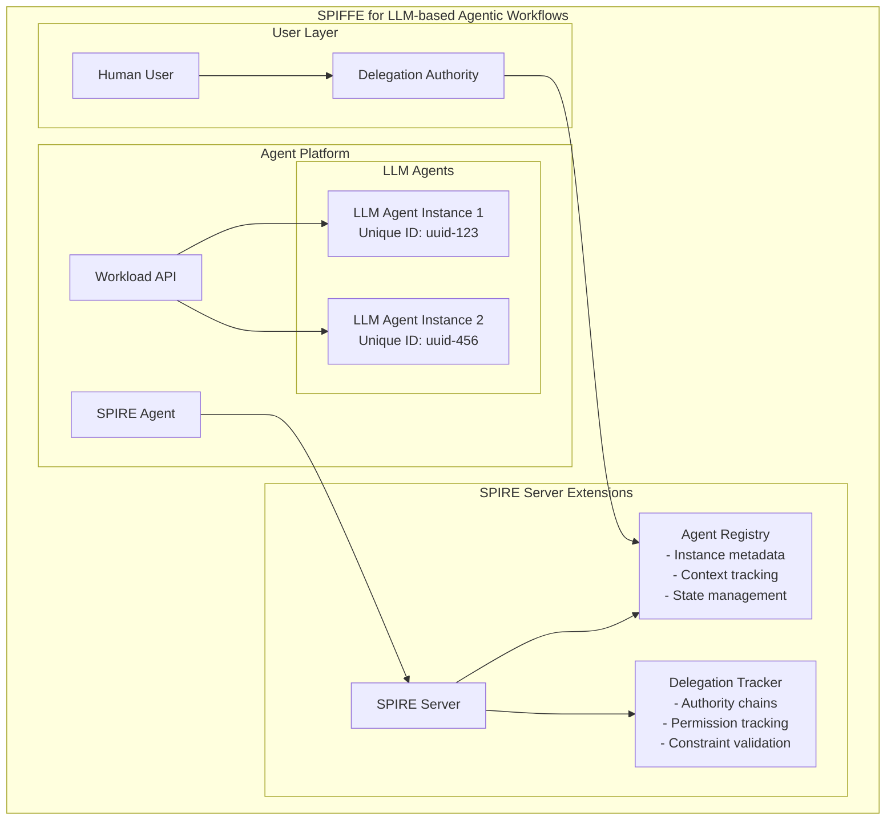
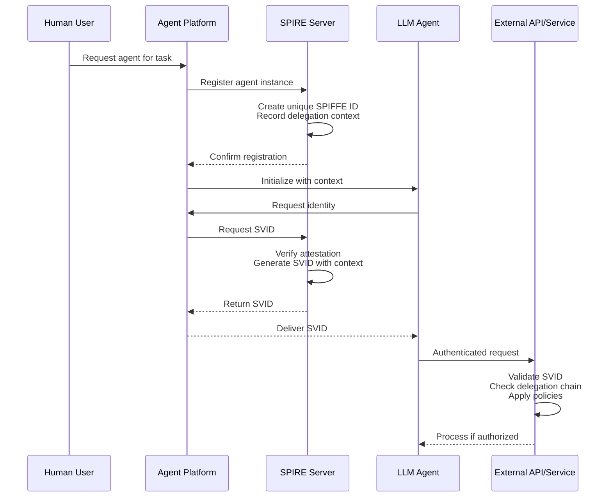
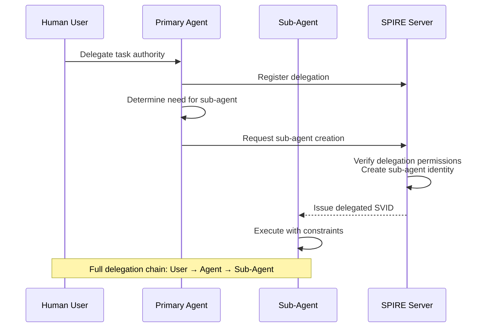
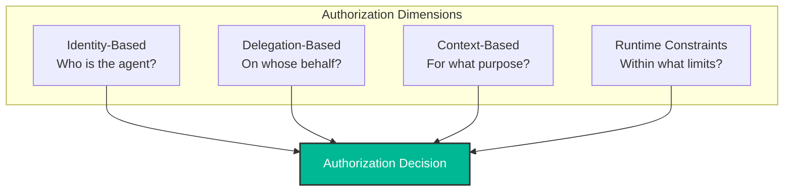

The rise of Large Language Model (LLM) based agents represents a paradigm shift in how software interacts with systems and users. Unlike traditional applications with deterministic behavior, LLM agents can make autonomous decisions, adapt to changing contexts, and act on behalf of users with varying degrees of independence. This autonomy introduces significant challenges for identity and authentication systems that were designed for either human users or traditional machine-to-machine communication.

As organizations deploy LLM agents for tasks ranging from customer service to data analysis and even financial operations, the need for robust identity, authentication, and authorization frameworks becomes critical. This blog explores how SPIFFE (Secure Production Identity Framework for Everyone) and its reference implementation SPIRE can be adapted to address the unique identity and authentication challenges of LLM-based agentic workflows.

## The Challenge of LLM Agent Identity

LLM-based agents differ fundamentally from traditional software systems in ways that directly impact identity and authentication requirements:

### Unique Characteristics of LLM Agents

1. **Non-deterministic Behavior**: Unlike traditional applications where identical inputs produce identical outputs, LLM agents may respond differently to the same prompt based on context, temperature settings, or other factors.

2. **Contextual Memory**: Agents maintain state and memory that influences their decisions and actions, making each instance potentially unique even if deployed from the same codebase.

3. **Autonomous Decision-Making**: Agents can make decisions without direct human intervention, requiring fine-grained attribution and accountability.

4. **Dynamic Tool Usage**: Many agents can dynamically discover and use tools or APIs based on the task at hand, requiring flexible but controlled access patterns.

5. **Delegation Chains**: Agents may create sub-agents or delegate tasks to other agents, creating complex chains of authority that must be tracked.

### Why Traditional Approaches Fall Short

Current approaches to machine identity fall short for LLM agents:

- **API Keys and Service Accounts** are too static and don't capture the dynamic nature of agents
- **User Impersonation** creates attribution problems and violates least privilege principles
- **Container Identity** treats all agent instances as identical, missing their unique contexts
- **Traditional OAuth** doesn't account for the ephemeral nature and delegation requirements of agents

## SPIFFE/SPIRE: A Foundation for Agent Identity

SPIFFE (Secure Production Identity Framework for Everyone) and its reference implementation SPIRE provide a solid foundation for workload identity that can be extended for LLM agents.

### Core SPIFFE Concepts

- **SPIFFE ID**: A unique identifier in the format `spiffe://trust-domain/path` that identifies a workload
- **SVID (SPIFFE Verifiable Identity Document)**: A document that attests to a workload's identity, implemented as X.509 certificates or JWT tokens
- **Trust Domain**: A logical boundary representing an administrative authority
- **Workload API**: A standardized API that workloads use to obtain their SVIDs

### Why SPIFFE Works for LLM Agents

SPIFFE's advantages align well with LLM agent requirements:
- Platform-agnostic identity that works across different environments
- Automated credential management and rotation
- Zero-trust security model based on workload identity
- Short-lived credentials that reduce risk
- Attestation-based identity verification

## Adapting SPIFFE for LLM Agents

To fully support LLM agents, several extensions to the standard SPIFFE/SPIRE architecture are needed:

### Extended Architecture Overview



### Key Extensions for LLM Agents

#### 1. Instance-Level Identity

Each LLM agent instance needs a unique SPIFFE ID that captures its specific context:
```
spiffe://example.org/agent/assistant/instance/uuid-123456
```

This enables precise tracking and authorization of individual agent instances, even when multiple instances are deployed from the same template.

#### 2. Delegation Chain Tracking

LLM agents often act on behalf of users or other agents. The extended framework tracks:
- Who delegated authority to the agent
- What permissions were delegated
- Temporal and contextual constraints
- The full chain of delegation for audit purposes

#### 3. Context-Aware Identity

Agent identities are enriched with contextual information:
- The agent's purpose and task
- Operating constraints and boundaries
- Memory and state indicators
- Runtime environment details

## Authentication Flow for LLM Agents

The authentication flow demonstrates how an LLM agent obtains and uses its identity:



## Delegation in Agentic Workflows

Delegation is critical for LLM agents as they often need to act on behalf of users or create sub-agents for specific tasks:



### Delegation Models

1. **Direct User Delegation**: Users explicitly delegate authority to agents for specific tasks
2. **Organizational Delegation**: Agents act on behalf of the organization with defined boundaries
3. **Agent-to-Agent Delegation**: Agents create sub-agents with constrained permissions

## Authorization and Security Controls

The extended SPIFFE framework enables sophisticated authorization for LLM agents:

### Multi-Dimensional Authorization



### Continuous Security Monitoring

For LLM agents, security isn't a one-time check but a continuous process:
- Real-time behavior monitoring
- Context validation throughout the agent's lifecycle
- Adaptive constraints based on observed behavior
- Immediate revocation capabilities for compromised agents

## Implementation Considerations

### Integration Approaches

1. **Agent Wrappers**: Wrap existing LLM agents with SPIFFE-aware identity management
2. **Sidecar Pattern**: Deploy identity management as a sidecar alongside agents
3. **SDK Integration**: Build SPIFFE support directly into agent platforms

### Scalability and Performance

- Implement efficient SVID caching to reduce server load
- Use hierarchical SPIRE deployments for large-scale systems
- Batch registration for multiple agent instances
- Optimize delegation chain validation

### Security Best Practices

- Frequent credential rotation for high-risk operations
- Immediate delegation revocation mechanisms
- Context validation to detect manipulation
- Comprehensive audit logging of all agent actions

## Conclusion

As LLM-based agents become increasingly integrated into enterprise workflows, the need for robust identity and authentication frameworks becomes critical. SPIFFE and SPIRE provide a solid foundation that can be extended to address the unique requirements of LLM agents.

Key takeaways:

1. **Instance-Level Identity is Essential**: Each agent instance needs unique identification that captures its context and state

2. **Delegation Must Be Explicit**: The chain of authority must be tracked for proper attribution and authorization

3. **Context Binding Provides Security**: Agent identities should be bound to their purpose and constraints

4. **Continuous Authorization is Required**: Security for autonomous agents requires ongoing validation, not just initial checks

5. **Standards-Based Approach Works**: Building on proven frameworks like SPIFFE provides a path to secure, interoperable agent identity

By adapting SPIFFE for LLM agents, organizations can deploy autonomous AI systems with confidence, knowing that proper identity, authentication, and authorization controls are in place. As the field of agentic AI continues to evolve, these foundational security principles will be essential for building trustworthy AI systems.

## References

1. [SPIFFE - Secure Production Identity Framework for Everyone.](https://spiffe.io/)

2. [SPIRE - SPIFFE Runtime Environment.](https://spiffe.io/docs/latest/spire-about/spire-concepts/)

3. Cloud Security Alliance. (2025). ["Agentic AI Identity Management Approach."](https://cloudsecurityalliance.org/blog/2025/03/11/agentic-ai-identity-management-approach)

4. WorkOS. (2025). ["How AI Agents authenticate and access systems."](https://workos.com/blog/how-ai-agents-authenticate-and-access-systems)

